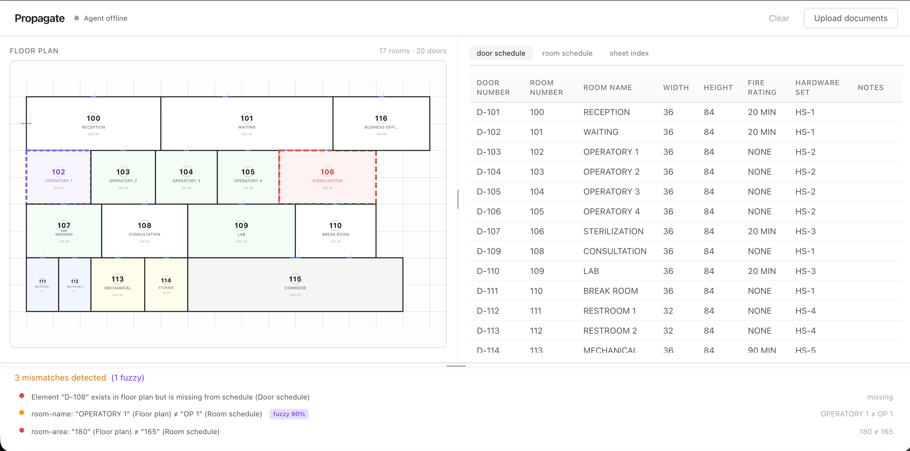
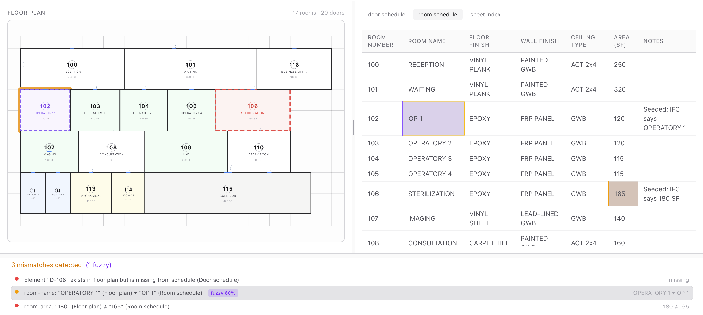
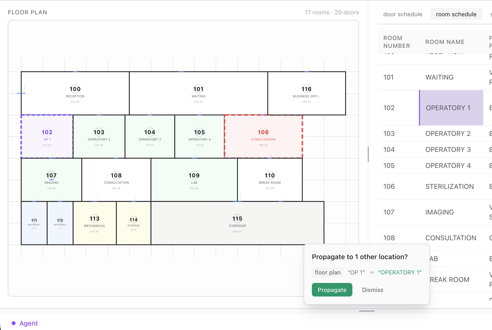
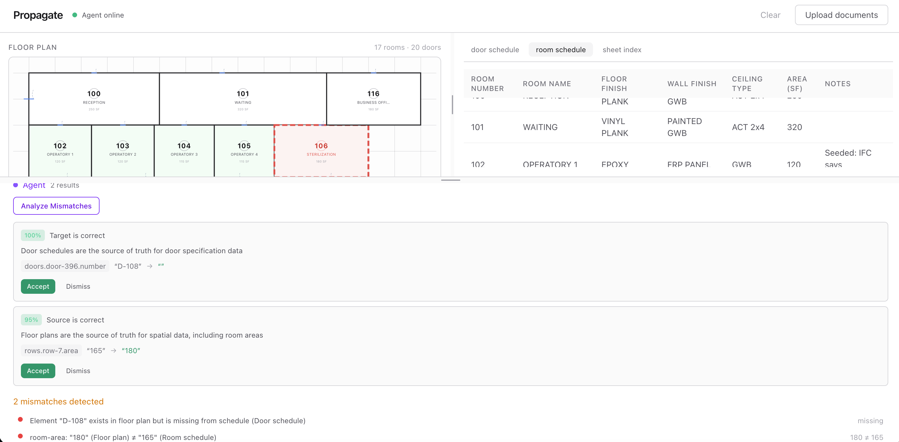

<p align="center">
  <h1 align="center">Propagate</h1>
  <p align="center">
    Cross-document impact analysis for BIM — detect mismatches across architecture documents and trace the ripple effect of every edit in real time.
  </p>
</p>

<p align="center">
  
  
  
  
  
  
  
  
</p>

<p align="center">
  
</p>

---

## The Problem

Architecture projects produce hundreds of interconnected documents: floor plans, door schedules, room finish schedules, sheet indices. A single change — renaming a room, moving a door — silently breaks references across dozens of sheets.

No tool solves this today. Cross-sheet coordination is a blind spot in the AEC industry.

## Key Features

- **Multi-format ingestion** — IFC models, Excel spreadsheets, and PDF schedules, each with a dedicated parser.
- **Cross-document mismatch detection** — Finds inconsistencies automatically: name drift, missing references, property mismatches.
- **Real-time propagation cascade** — Edit a value on one document, instantly see which fields on other documents break.
- **Two-layer matching** — Exact matching by IDs/numbers, plus fuzzy matching via trigram vectors (LanceDB) to catch naming drift like "OPERATORY 1" vs "OP 1".
- **Multi-client sync** — Edits propagate to all connected clients in real-time via WebSocket.
- **AI-powered analysis** — Optional local LLM agent (Ollama) suggests fixes for mismatches and validates fuzzy matches.
- **Graceful degradation** — Core functionality works with zero external services. Redis, Firebase, LanceDB, and Ollama each degrade silently when unavailable.

## Screenshots


_All documents loaded — floor plan with room overlays, schedule table with editable cells, mismatch count in the impact bar._


_Clicking a mismatch highlights the room on the floor plan and scrolls to the corresponding cell in the schedule._


_After editing a cross-referenced field, the propagation prompt shows which values on other documents would change._


_The AI agent analyzes mismatches and suggests which document holds the correct value._

## How It Works

1. **Ingest** real BIM documents (IFC, Excel, PDF). Users upload native files; Propagate parses them into a typed internal representation.
2. **Build a dependency graph** using exact matching (IDs, numbers) and fuzzy vector matching (LanceDB) to catch naming drift.
3. **Detect mismatches** that already exist across documents.
4. **Trace impact** when a field is edited. Change a room name on the floor plan and instantly see which schedule cells break.

The system never assumes which document is right. It shows divergence. The user decides what to fix.

## Project Structure

```
propagate/
├── packages/
│   ├── contracts/          Shared TypeScript types (documents, cross-refs, events)
│   └── crossref/           Pure TS cross-reference engine (runs client + server)
├── apps/
│   ├── engine/             NestJS backend (ingestion, graph, WebSocket gateway)
│   └── web/                Next.js frontend (floor plan SVG, schedule tables, editing)
├── samples/                Sample data (dental clinic)
└── docs/                   Screenshots and diagrams
```

## Built With

| Layer                | Technology                                   | Purpose                                                                   |
| -------------------- | -------------------------------------------- | ------------------------------------------------------------------------- |
| **Engine**           | NestJS, TypeScript                           | Module system with dependency injection, typed end-to-end                 |
| **Web**              | Next.js (App Router), React 19, Tailwind CSS | Server components where needed, client interactivity everywhere else      |
| **State**            | Zustand                                      | Lightweight reactive state for sub-millisecond client-side graph rebuilds |
| **Ingestion**        | web-ifc, ExcelJS, pdf-parse                  | Dedicated parser per format — BIM geometry, spreadsheets, text extraction |
| **Real-time**        | Socket.io                                    | Typed WebSocket events for multi-client edit sync and broadcast           |
| **Cache**            | Redis                                        | Write-through cache for state persistence across server restarts          |
| **File storage**     | Firebase Storage                             | Original file persistence for audit trail and re-download                 |
| **Fuzzy matching**   | LanceDB                                      | Embedded vector database for trigram-based similarity search              |
| **AI agent**         | Ollama (local LLM)                           | Fix suggestions and fuzzy match validation, fully optional                |
| **Cross-ref engine** | Pure TypeScript                              | Framework-free, deterministic, no LLM — runs on client and server         |

## Getting Started

```bash
pnpm install
pnpm dev            # start engine (port 3001) + web (port 3000)
pnpm dev:engine     # engine only
pnpm dev:web        # web only
pnpm typecheck      # typecheck all packages
pnpm test           # run all tests
```

Copy `.env.example` to `.env` and fill in the values as needed. All external services are optional — the app runs with defaults if nothing is configured.

| Variable                   | Required | Default                  | Purpose                                                                       |
| -------------------------- | -------- | ------------------------ | ----------------------------------------------------------------------------- |
| `PORT`                     | No       | `3001`                   | Engine server port                                                            |
| `REDIS_URL`                | No       | —                        | Redis connection. Without it, state won't survive restarts.                   |
| `FIREBASE_STORAGE_BUCKET`  | No       | —                        | Firebase Storage bucket. Without it, original files aren't persisted.         |
| `FIREBASE_SERVICE_ACCOUNT` | No       | —                        | Firebase service account JSON. Falls back to Application Default Credentials. |
| `LANCEDB_PATH`             | No       | `./data/lancedb`         | LanceDB embedded database directory. Without it, no fuzzy matching.           |
| `OLLAMA_BASE_URL`          | No       | `http://localhost:11434` | Ollama API endpoint. Without it, agent features are disabled.                 |
| `OLLAMA_MODEL`             | No       | `llama3.1`               | Model for agent analysis.                                                     |
| `NEXT_PUBLIC_ENGINE_URL`   | No       | `http://localhost:3001`  | Engine URL for the web client.                                                |

## Usage Guide

### 1. Upload your documents

Click the **Upload** button in the header and select your files. You need at least one floor plan (`.ifc`) and one schedule (`.xlsx`, `.xls`, or `.pdf`) for cross-referencing to work.

Files are processed sequentially — the UI updates after each file, so you'll see cross-references build up as documents land.

**Troubleshooting:**
- **Upload fails or hangs:** Make sure the engine is running on port 3001 (`pnpm dev:engine`). Check the terminal for parse errors.
- **IFC file not parsing:** The IFC parser uses `web-ifc` which requires a valid IFC 2x3/4 file. Corrupted or non-standard IFC files will throw an error.
- **PDF not recognized as a schedule:** The PDF must be text-based with pipe-delimited (`|`) tables. Scanned PDFs or PDFs without pipe separators won't parse. See [Assumptions & Limitations](#assumptions--limitations).
- **Wrong schedule type detected:** The system infers schedule type from the filename (e.g., "door" in the name → door schedule). If your file is misclassified, re-upload with `?scheduleType=door|room|sheet-index` as a query parameter, or rename the file.

### 2. Review mismatches

After uploading, the **impact bar** at the bottom shows detected mismatches. Each mismatch represents a value that differs between two documents — a room name that doesn't match, a missing door reference, or a property inconsistency.

Click any mismatch row to navigate to it: the floor plan highlights the affected room with an amber ring, and the schedule table switches tabs and scrolls to the corresponding cell.

**Troubleshooting:**
- **No mismatches detected:** Mismatches require cross-references. If documents don't share any room numbers or door numbers, there's nothing to compare. Check that your floor plan rooms have IDs that match your schedule row numbers.
- **Expected mismatch not showing:** Only the `name`, `number`, and `area` fields are compared. Other schedule columns (finishes, hardware, etc.) are not cross-referenced.

### 3. Edit a value

Double-click any cell in the schedule table to edit it. Press **Enter** to commit or **Escape** to cancel.

After committing an edit on a cross-referenced field (`name`, `number`, or `area`), the system checks if the change should propagate to other documents. If propagation targets exist, a prompt appears at the bottom of the screen.

**Troubleshooting:**
- **No propagation prompt after editing:** You edited a field that has no cross-reference. Only `name`, `number`, and `area` columns are linked across documents. Editing other columns (like "finish" or "hardware") won't trigger propagation.
- **Edit doesn't persist after refresh:** Without Redis configured, state is in-memory only and won't survive a server restart. Set `REDIS_URL` in your `.env` for persistence.

### 4. Propagate changes

When the propagation prompt appears, it shows which values on other documents would change. You have two options:

- **Propagate** — applies the proposed changes to all listed locations across documents.
- **Dismiss** — keeps the edit you made but doesn't cascade it. Other documents retain their original values, which may now be a mismatch.

### 5. Use the AI agent (optional)

If Ollama is running locally, the agent status badge in the header shows "Agent online". Two AI features become available in the agent panel:

- **Analyze Mismatches** — the agent reviews current mismatches and suggests which document holds the correct value, with confidence scores and reasoning.
- **Confirm Fuzzy Matches** — the agent evaluates fuzzy-matched cross-references (e.g., "OPERATORY 1" vs "OP 1") and confirms or rejects them.

**Troubleshooting:**
- **Agent shows offline:** Ollama isn't running or isn't reachable. Start it with `ollama serve` and ensure `OLLAMA_BASE_URL` in `.env` points to it (default: `http://localhost:11434`).
- **Agent suggestions are slow:** The first request may take time while the model loads into memory. Subsequent requests are faster.
- **Model not found:** Run `ollama pull llama3.1` (or whichever model is set in `OLLAMA_MODEL`).

### 6. Reset

Click the **Clear** button in the upload area to remove all documents and start fresh. This clears in-memory state and deletes the Redis cache.

## Sample Data

The `samples/` directory contains a dental clinic dataset for development and testing:

| File                 | Format  | Contents                                              |
| -------------------- | ------- | ----------------------------------------------------- |
| `dental-clinic.ifc`  | IFC 2x3 | Floor plan with 17 rooms, 20 doors, 10 walls          |
| `room-schedule.xlsx` | Excel   | Room finish schedule (17 rows)                        |
| `door-schedule.xlsx` | Excel   | Door schedule (19 rows — D-108 intentionally missing) |
| `sheet-index.xlsx`   | Excel   | Sheet index (4 sheets)                                |
| `room-schedule.pdf`  | PDF     | PDF version of the room schedule                      |

Four mismatches are seeded across these files to demonstrate cross-document detection:

1. **Name drift:** Floor plan says "OPERATORY 1" (room 102), room schedule says "OP 1"
2. **Missing reference:** Door D-108 exists in the IFC model but is absent from the door schedule
3. **Property mismatch:** Floor plan has 180 SF for STERILIZATION (room 106), room schedule says 165 SF
4. **Rename drift:** Floor plan says "IMAGING" (room 107), sheet index A102 references "X-RAY"

<details>
<summary>Regenerating sample files</summary>

The sample files are checked into the repo so tests work immediately after cloning. To regenerate from scratch:

```bash
npx tsx samples/generate-ifc.ts          # generates dental-clinic.ifc
npx tsx samples/generate-schedules.ts    # generates *.xlsx files
npx tsx samples/generate-pdf.ts          # generates room-schedule.pdf
```

</details>

## Ingestion

Upload a file to parse it into a typed `DocumentEnvelope`:

```bash
# IFC model → FloorPlan
curl -X POST http://localhost:3001/api/upload -F file=@samples/dental-clinic.ifc

# Excel schedule (type inferred from filename)
curl -X POST http://localhost:3001/api/upload -F file=@samples/room-schedule.xlsx

# Explicit schedule type override
curl -X POST http://localhost:3001/api/upload?scheduleType=door -F file=@samples/door-schedule.xlsx

# PDF schedule
curl -X POST http://localhost:3001/api/upload -F file=@samples/room-schedule.pdf
```

### Supported formats

| Extension       | Parser    | Output type                                        |
| --------------- | --------- | -------------------------------------------------- |
| `.ifc`          | web-ifc   | `floor-plan`                                       |
| `.xlsx`, `.xls` | ExcelJS   | `room-schedule`, `door-schedule`, or `sheet-index` |
| `.pdf`          | pdf-parse | `room-schedule`, `door-schedule`, or `sheet-index` |

File type is detected by extension, not MIME type.

### Schedule type inference

For Excel and PDF files, the schedule type is inferred from the filename:

- Filename contains `door` → `door-schedule`
- Filename contains `sheet-index` or `sheet_index` → `sheet-index`
- Default → `room-schedule`

Floor plans are identified by the `.ifc` extension only. Override inference with the `?scheduleType=door|room|sheet-index` query parameter.

## Design Decisions

### Server-side file processing

Files are uploaded to the NestJS engine rather than directly to cloud storage. Each format requires server-side parsing — IFC uses `web-ifc` (C++ WASM module), Excel uses `ExcelJS`, PDF uses `pdf-parse` — none run reliably in the browser. The server parses the file into a typed representation, stores it in memory and Redis, and optionally persists the original bytes to Firebase Storage as an audit trail.

### Sequential uploads with progressive feedback

Files are uploaded one at a time, not as a batch. Every upload returns the updated cross-reference graph, so the UI reflects changes progressively — new mismatches appear as each document lands rather than all at once after a batch completes.

### Separate concerns for storage layers

Firebase Storage and Redis are not alternatives — they store different things and serve different purposes:

| Layer                | What it stores                   | Purpose                                         |
| -------------------- | -------------------------------- | ----------------------------------------------- |
| **In-memory**        | Parsed documents, fuzzy refs     | Runtime working state for fast graph operations |
| **Redis**            | Parsed documents (write-through) | Persistence across server restarts              |
| **Firebase Storage** | Original file bytes              | Audit trail and re-download capability          |

All three run in parallel when configured. Only in-memory is required.

### Write-through caching

Every mutation (document upload, value edit, propagation) writes to Redis immediately after updating in-memory state. On server restart, the graph service hydrates from Redis and recovers its full state. The alternative — periodic snapshots — risks losing edits between intervals. If Redis is unavailable, the app still works but state won't survive a restart.

### In-memory graph computation

Parsed documents and cross-references live in server memory. The graph is rebuilt on every edit — `buildGraph()` and `checkConsistency()` complete in under 1ms for typical BIM document sets. This is a single-server, single-process design optimized for simplicity and project-level scale. For horizontal scaling, the in-memory store would be replaced with a persistent database.

### External Services

All external services are optional. Each checks availability on startup and degrades silently:

| Service          | If unavailable               | Core impact                      |
| ---------------- | ---------------------------- | -------------------------------- |
| Redis            | No restart persistence       | None — app works in-memory       |
| Firebase Storage | Original files not persisted | None — parsed state still cached |
| LanceDB          | No fuzzy matching            | Exact matching still works       |
| Ollama           | No AI suggestions            | Manual editing still works       |

Core functionality — upload, parse, exact matching, editing, propagation — works with zero external dependencies.

## Assumptions & Limitations

- **Excel:** Only the first sheet is parsed. In BIM practice, each schedule type is typically a separate file. Multi-sheet workbooks would need to be split before upload.
- **PDF:** Must be text-based (no scanned images, no OCR). Tables must use pipe (`|`) characters as column delimiters. The header row must appear within the first 10 lines and contain keywords like "number", "name", or "sheet".
- **IFC:** Rooms are extracted from `IFCSPACE` entities, doors from `IFCDOOR`. Other entity types (windows, MEP equipment) are not currently parsed.
- **File types:** Detected by file extension, not by content sniffing or MIME type.
- **Scale:** Designed for project-level document sets (tens of documents). The in-memory architecture provides sub-millisecond graph rebuilds but is not intended for enterprise-scale repositories.
